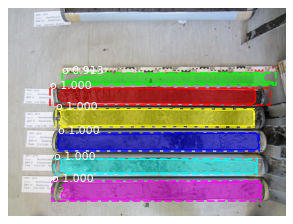

# Open and run Notebooks in Google Colab 

This Youtube video [Get started with Google Colaboratory (Coding TensorFlow)](https://www.youtube.com/watch?v=inN8seMm7UI) shows a general introduction to Google Colab (3 min).

* copy the following link:  ``` https://github.com/swafe/Masterthesis/blob/master/Mask_rcnn_small_tf1_soiltyp/train_test_Mask_rcnn_tf1_soiltype.ipynb ```
* click [here](https://colab.research.google.com/notebooks/intro.ipynb) to open Google Colab
* in Google Colab go to File, open notebook
* in the opened Window go to the GitHub Tab and paste the copied Link to have access to the repository
* choose the test notebook
Now you can run the Code-Cells in Google Colab step by step and follow the instructions in the notebook

Further Information:
* to see the uploaded folders, click on the file symbol on the left side bar 
* if you are not logged in to your Gmail account, a Window appears to sign in. 
* For information, Coolab creates a folder 'Colab' in your google drive.


# Mask_rcnn_small_tf1 (Masterarbeit zur Bodenklassifizierung)
Dieses Projekt verwendet das [Mask RCNN Repository von Matterport](https://github.com/matterport/Mask_RCNN) als Vorlage. Es ist in Python programmiert und verwendet die Keras Architectur API und die Tensorflow Backend API. Die Vorlage ist wie folgt beschrieben: "The model generates bounding boxes and segmentation masks for each instance of an object in the image. It's based on Feature Pyramid Network (FPN) and a ResNet101 backbone."  
Die Vorlage bietet Beispiele um das Mask R-CNN Modell mit eigenen Datensätzen zu traineren. Für dieses Projekt wurde das 'balloon  sample' verwendet und angepasst. Eine ausführliche Beschreiung findet sich in diesem [blog post about the balloon color splash sample](https://engineering.matterport.com/splash-of-color-instance-segmentation-with-mask-r-cnn-and-tensorflow-7c761e238b46).

Dieses Repository beinhaltet:
* Source code of Mask R-CNN built on FPN and ResNet101.
* Source code for soilsample sample
* Image datasets
* Notebooks for training and testing model

# Getting Started
* mask_rcnn/(model.py, utils.py, config.py): Diese Scripte beinhalten die 'main Mask RCNN implementation'.
* sample/soilsample.py: Dieses Script beinhaltet die Methoden für das Training und Tests der Datensätze sowie weitere Konfigurationen für das Mask R-CNN Modell. 
* train_Mask_rcnn_small_tf1_soilsample.ipynb leidet sich von inspect_data.ipynb aus balloon _sample ab. Dieses notebook zeigt die verscheidenen pre-processing Schritte um die Daten für das Training vorzubereiten und ruft soilsample.py zum Trainieren des Modells auf. 
* test_Mask_rcnn_small_tf1_soilsample_model.ipynb leitet sich von inspect_model.ipynb aus balloon_sample ab. Dieses notebook zeigt die Schritte um Objekte zu detektieren und zu segmentieren. 

# Training mit eigenem Datensatz
from [Mask RCNN Repository von Matterport](https://github.com/matterport/Mask_RCNN):

Start by reading this [blog post about the balloon color splash sample](https://engineering.matterport.com/splash-of-color-instance-segmentation-with-mask-r-cnn-and-tensorflow-7c761e238b46). It covers the process starting from annotating images to training to using the results in a sample application.

In summary, to train the model on your own dataset you'll need to extend two classes:

```Config```
This class contains the default configuration. Subclass it and modify the attributes you need to change.

```Dataset```
This class provides a consistent way to work with any dataset. 
It allows you to use new datasets for training without having to change 
the code of the model. It also supports loading multiple datasets at the
same time, which is useful if the objects you want to detect are not 
all available in one dataset. 

See examples in `samples/shapes/train_shapes.ipynb`, `samples/coco/coco.py`, `samples/balloon/balloon.py`, and `samples/nucleus/nucleus.py`.

Die einzelnen Schritte des Trainings werden im Notebook [train_Mask_rcnn_small_tf1_soilsample.ipynb](train_Mask_rcnn_small_tf1_soilsample.ipynb) dargestellt und erläutert.

# Testen des trainierten Modells 
Die einzelnen Schritte werden im Notebook [test_Mask_rcnn_small_tf1_soilsample_model.ipynb](test_Mask_rcnn_small_tf1_soilsample_model.ipynb) dargestellt und erläutert.



# Preprocessing
Workflow:
for workflow see fig.

# Citations 
@misc{matterport_maskrcnn_2017,
  title={Mask R-CNN for object detection and instance segmentation on Keras and TensorFlow},
  author={Waleed Abdulla},
  year={2017},
  publisher={Github},
  journal={GitHub repository},
  howpublished={\url{https://github.com/matterport/Mask_RCNN}},
}
